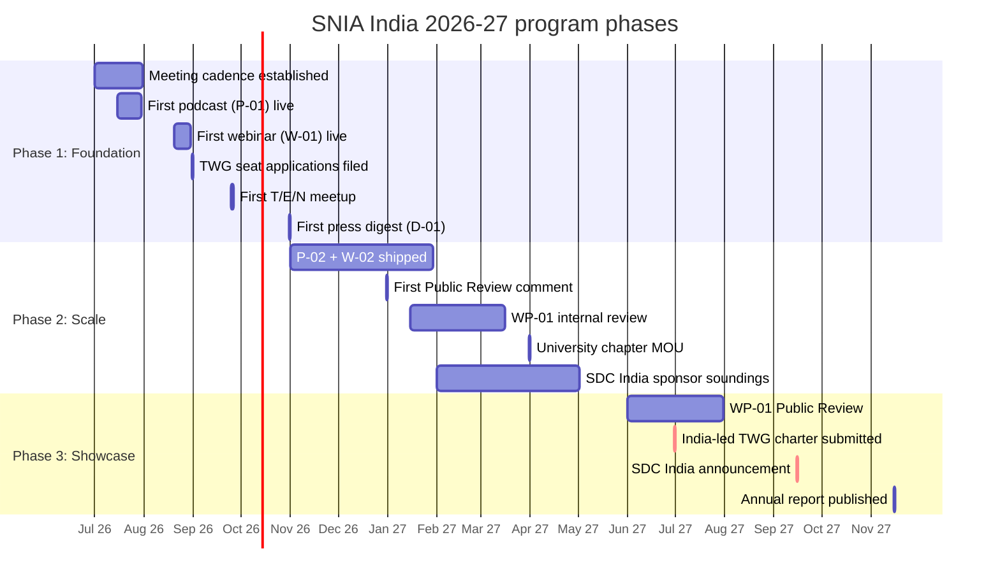

# Roadmap — Editorial Calendar (Jul 2026 → Nov 2027)

> The single source of truth for what SNIA India ships when. Every row resolves to five named roles (Creator, Reviewer, Approver, Amplifier, Speaker) before the Creator picks up the work — that is the operational expression of `T-IND-01` in [`charter.md`](charter.md).
>
> **Note (May 2026).** The original 12-month plan (Mar 2026 – Feb 2027) targeted ~36 outbound artifacts. Given the late start (no artifacts shipped as of 22 May 2026) and realistic member bandwidth, the plan has been adjusted: 17-month horizon, ~25 outbound artifacts, quarterly cadence for podcasts and webinars.

## Cadence summary

| Outbound | Count | Cadence |
|---|---|---|
| Podcasts | 4 | Quarterly on Eric Wright's *SNIA Experts on Data* pipeline |
| Webinars | 4 | Quarterly on SNIA India BrightTALK channel |
| Blogs | 8 | ~2/quarter — Q&A follow-up after each webinar/podcast + occasional standalone |
| White papers | 2 | 1 SNIA-ratified (WP-01) + 1 position paper (R-01 annual report) |
| T/E/N meetups | 3 | Quarterly from Q3 2026; location and host decided per event by TC |
| Press digests | 3 | Quarterly from Q4 2026 |
| Annual report | 1 | *State of Indian Storage 2027* — Nov 2027 |
| **Total outbound** | **~25** | |

Plus structural deliverables: 2 TWG seats, ≥8 Public Review comments, 1 university chapter, 1 India-named global SNIA deliverable, 1 India-led TWG charter, SDC India announcement.

## Artifact ID convention

- `P-NN` podcast episodes
- `W-NN` webinars
- `B-NN` blogs
- `WP-NN` white papers
- `D-NN` press digests
- `T-NN` T/E/N meetups
- `R-NN` annual reports
- `S-NN` structural deliverables (TWG seats, university chapters, etc.)

## Three program phases

### Phase 1 — Foundation (Jul–Oct 2026)

Get the basics running. Ship the first podcast, webinar, blog, and T/E/N. Apply for TWG seats. Establish meeting cadence.

### Phase 2 — Scale (Nov 2026–May 2027)

Hit steady cadence. WP-01 into internal review. First Public Review comments filed. University chapter pilot. SDC India sponsor soundings.

### Phase 3 — Showcase (Jun–Nov 2027)

WP-01 in Public Review and ratified. India-led TWG charter submitted. Annual report published. SDC India announced.

## Detailed calendar

**C** Creator, **R** Reviewer, **A** Approver. Amplifier is always Khushboo Gupta + the quarter's Operations Buddy. Status legend: `[planned]` committed, `[in-flight]` in production, `[shipped]` published, `[slipped]` missed date, `[cancelled]` formally dropped.

**T/E/N note.** T/E/N meetup details (topic, location, host, speakers, ownership) are fully decided by the TC closer to each event based on logistics and member availability. Only target quarter is fixed in this calendar.

### Phase 1 — Foundation (Jul–Oct 2026)

| Target date | ID | Artifact | C | R | A | Speakers |
|---|---|---|---|---|---|---|
| 2026-07-15 | `P-01` | Podcast Ep.1 — *Launching SNIA India: Vision + Three Storage Decisions India Must Make* (10 min vision + 35 min substance on Storage.AI / DPDP / IndiaAI Mission) | Sriram | Karnendu | Piyush | Piyush + Shelesh |
| 2026-07-22 | `B-01` | Blog — *Why SNIA India 2026 matters* (companion to P-01) | Sriram | Karnendu | Piyush | — |
| 2026-08-20 | `W-01` | Webinar 1 — *Composable Memory with CXL — India CIO View* | Mohan | Sriram | Aditya | Mohan + Mohit Aron |
| 2026-08-31 | `S-01` | Storage.AI TWG seat applied | Sriram + Mohan | TC | Piyush | — |
| 2026-08-31 | `S-02` | CS TWG seat applied | Aadish + Manjeet + Mohan | TC | Piyush | — |
| 2026-09-03 | `B-02` | Blog — *CXL 4.0 explained for India CIOs* (W-01 Q&A) | Mohan | Sriram | Aditya | — |
| Q3 2026 | `T-01` | T/E/N meetup — details TBD by TC | TBD | TBD | TBD | TBD |
| 2026-10-31 | `D-01` | Press digest Q3 — first quarterly newsletter to Indian press | Khushboo + Shiva | Karnendu | Piyush | — |

**Phase 1 Operations Buddy:** Shiva Perabathini (NetApp, Secretary) through Q2; Aditya Sharma (HPE) for Q3.

### Phase 2 — Scale (Nov 2026–May 2027)

| Target date | ID | Artifact | C | R | A | Speakers |
|---|---|---|---|---|---|---|
| 2026-11-12 | `P-02` | Podcast Ep.2 — *Storage Architecture for India's Sovereign AI Clouds* | Sriram | Sunil | Piyush | Sunil Gupta (Yotta) + Hemant Darbari (CDAC) |
| 2026-11-26 | `B-03` | Blog — *Sovereign AI storage: what Indian CIOs are asking* (P-02 companion) | Sriram | Vinoth | Piyush | — |
| Q4 2026 | `T-02` | T/E/N meetup — details TBD by TC | TBD | TBD | TBD | TBD |
| 2026-12-31 | `S-03` | First Public Review comment filed (CS TWG) | Aadish | Karnendu | Piyush | — |
| 2027-01-15 | `D-02` | Press digest Q4 | Khushboo + Anil | Karnendu | Piyush | — |
| 2027-02-12 | `W-02` | Webinar 2 — *DPDP Rules 2025 — What Storage and Backup Teams Must Implement* | Vinoth | Sunil | Shelesh | Rahul Matthan (Trilegal) + Vinoth |
| 2027-02-26 | `B-04` | Blog — *DPDP Rule 6 explained: encryption, log retention, erasure* (W-02 Q&A) | Vinoth | Sunil | Shelesh | — |
| 2027-03-15 | `WP-01` | WP-01 outline approved — *Storage Architecture Requirements for India's Sovereign AI Clusters* | Sriram (lead) + Mohan + Sunil | Karnendu | Piyush | — |
| 2027-03-31 | `S-04` | First Public Review comment filed (Storage.AI) | Sriram or Mohan | Karnendu | Piyush | — |
| 2027-03-31 | `S-06` | University chapter MOU (IIT Bombay CASPER, Biswabandan Panda) | Mohan + Sriram | Piyush + Sharad | Piyush | — |
| 2027-04-16 | `P-03` | Podcast Ep.3 — *India Stack at UPI Scale — A Storage Conversation* | Sriram | Vinoth | Piyush | Pramod Varma (EkStep) + Vishal Anand Kanvaty (NPCI CTO) |
| 2027-04-30 | `B-05` | Blog — *India Stack storage: 10 questions answered* (P-03 companion) | Sriram | Rahul Nema | Piyush | — |
| 2027-05-21 | `W-03` | Webinar 3 — *KV Cache as Tier-0 for Indian Inference Clouds* | Mohan | Sriram | Aditya | Madhusudhana (NVIDIA India) + Vasanthi Ramesh (NetApp India) |
| 2027-05-30 | `B-06` | Blog — *Where does KV cache live in 2027?* (W-03 Q&A) | Mohan | Aadish | Aditya | — |

**Phase 2 Operations Buddy rotation:** Anil Kumar Boggarapu (Nutanix, Q3-Q4 2026), then Sameer Kshatriya (Marvell, Q1-Q2 2027).

### Phase 3 — Showcase (Jun–Nov 2027)

| Target date | ID | Artifact | C | R | A | Speakers |
|---|---|---|---|---|---|---|
| 2027-06-01 | `WP-01` | **WP-01 enters SNIA Public Review (60 days)** | Sriram (lead) | Karnendu + Hemant Darbari (ext) | Piyush + SNIA US TC | — |
| 2027-06-30 | `TWG-01` | India-led TWG charter submitted — *Sovereign Storage Primitives* | Vinoth (lead) + Sriram + Sunil | Karnendu + iSPIRT ext | Piyush + SNIA US TC | — |
| 2027-07-01 | `D-03` | Press digest Q2 2027 | Khushboo + Sameer | Karnendu | Piyush | — |
| 2027-08-01 | `WP-01` | **WP-01 ratified by SNIA TC** (target) | Sriram | Karnendu | Piyush + SNIA US TC | — |
| 2027-08-13 | `P-04` | Podcast Ep.4 — *Multi-Script Indic Datasets at Petabyte Scale* | Rahul Nema | Sriram | Piyush | Amitabh Nag (Bhashini) + Yogesh Simmhan (IISc) |
| 2027-08-27 | `B-07` | Blog — *Multi-script storage: what changes with 22 scripts* (P-04 companion) | Rahul Nema | Karnendu | Piyush | — |
| 2027-09-15 | `W-04` | **Webinar 4 — *Year in Review + SDC India Announcement*** | Karnendu | Sriram + Vinoth | Piyush + PK Gupta | PK Gupta + Karnendu + full TC |
| Q3 2027 | `T-03` | T/E/N meetup — details TBD by TC | TBD | TBD | TBD | TBD |
| 2027-10-01 | `B-08` | Blog — *2027 in numbers — what SNIA India shipped* | Khushboo + Karnendu | Sriram | Piyush | — |
| 2027-10-15 | `S-05` | India named on a Storage.AI deliverable (target) | Sriram + Mohan + Rahul Nema | Karnendu | Piyush + SNIA US TC | — |
| 2027-11-15 | `R-01` | **Annual report — *State of Indian Storage 2027*** | Karnendu (lead) + full TC | Piyush + Shelesh + PK | Piyush + Board | — |

**Phase 3 Operations Buddy:** Sameer Kshatriya (Marvell, continuing from Q2 2027).

---

## Ownership summary

### The five named roles

| Role | Symbol | Responsibility |
|---|---|---|
| **Creator** | C | Drafts the artifact, hosts the session, owns on-time delivery |
| **Reviewer** | R | Peer TC member; signs off on technical accuracy and India framing |
| **Approver** | A | Board member or TC Head (Mohan); signs off on chapter alignment, IP, SNIA US coordination |
| **Amplifier** | M | Khushboo + Ops Buddy; handles publication, social, press |
| **Speaker(s)** | S | For podcasts and webinars; the on-air voices |

Every artifact has all five roles named **before** the Creator picks up the work. If a role cannot be filled, the artifact is deferred to the next slot.

### Per-TC-member load

| TC member | Creator artifacts | Reviewer load | TWG seat |
|---|---|---|---|
| Mohan Parthasarathy (TC Head) | 3 | All white papers; TWG liaison | Storage.AI |
| Sriram Popuri | 7 (incl. WP-01 lead) | ~5 | Storage.AI |
| Sunil Kumar | 1 (+ WP-01 co-author) | ~3 | Green / Security (light) |
| Rahul Nema | 2 | ~3 | Cloud Storage / CDMI (light) |
| Dnyaneshwar Pawar | — (reviewer-heavy) | ~4 | Storage.AI observer |
| Aadish Kuvelker | — (CS TWG comment lead) | ~3 | Computational Storage |
| Vinoth Velayutham | 2 (+ TWG charter lead) | ~4 | Security; future TWG lead |
| Manjeet Kumar | — (reviewer) | ~2 | Computational Storage |
| Karnendu Pattanaik | 3 (incl. R-01 lead, W-04) | ~4 | — |

Mohan carries TC Head governance duties (quarterly review, TWG liaison, ownership checks) alongside his Creator load. Sriram and Karnendu carry the heaviest Creator loads.

### Operations Buddy rotation

| Period | Operations Buddy | Focus |
|---|---|---|
| Jul–Sep 2026 | **Shiva Perabathini** (NetApp) → **Aditya Sharma** (HPE) | BrightTALK setup, first-artifact amplification |
| Oct–Dec 2026 | **Anil Kumar Boggarapu** (Nutanix) | Hyperscaler relations, sponsor soundings |
| Jan–Jun 2027 | **Sameer Kshatriya** (Marvell) | SDC India sponsor pipeline, Program Committee |

Each Buddy commits ~3-5 hr/week for their period, joins the weekly TC sync, and hands off with a 1-page transition memo.

### Conflict-of-interest rules

- No artifact may have Creator + Reviewer + Approver from the same employer.
- Vendor product comparisons need ≥1 external reviewer.
- No ≥50% same-vendor speakers on a single panel.
- SDC India sponsor benefits are tiered, transparent, and identical within tier.

## White paper roadmap

| ID | Title | Track | Lead | Target dates |
|---|---|---|---|---|
| `WP-01` | *Storage Architecture Requirements for India's Sovereign AI Clusters* | SNIA-ratified | Sriram Popuri | Outline Mar 2027 → Internal review Apr-May → Public Review Jun-Jul → Ratification Aug 2027 |
| `R-01` | *State of Indian Storage 2027* | Vendor-neutral position paper | Karnendu Pattanaik | Draft Sep 2027 → Review Oct → Publication Nov 2027 |

WP-02 (*Consent-Tagged Storage Primitives*) is deferred to year 2, when the India-led TWG charter provides a stronger foundation.

## Slot-fill rules

When an artifact slot is at risk (≤30 days out and any role unfilled):

1. Mohan (TC Head) flags it at the next weekly TC sync.
2. The Operations Buddy identifies a backup Creator from the same domain.
3. If no backup is available within 7 days, the artifact is deferred (not cancelled, on first slip).
4. If it slips a second time, it is formally cancelled at the next quarterly review.

## Versioning

| Version | Date | Change |
|---|---|---|
| 0.1 | 2026-05-22 | Initial roadmap. Adjusted from original Mar 2026 start to Jul 2026 start. Reduced from ~36 to ~25 artifacts over 17 months. For TC + Board review. |
